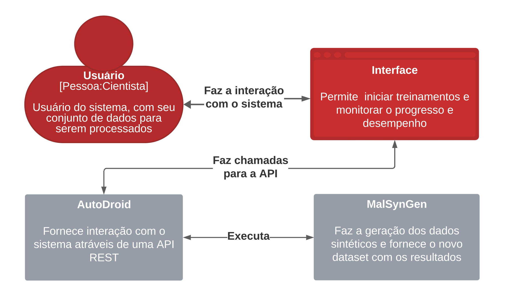

# GUI4MalSynGen

GUI4MalSynGen é uma interface gráfica para o MalSynGen, uma ferramenta integrada à plataforma Malware DataLab, dedicada à geração de dados tabulares sintéticos voltados para o ensino de técnicas de aprendizado profundo. Este projeto auxilia Hackers do Bem a expandirem datasets de malwares Android, permitindo que se preparem para combater ameaças cada vez mais sofisticadas.

## Sumário

- [Arquitetura](#arquitetura)
- [Requisitos](#requisitos)
- [Instalação](#instalação)
- [Execução com Docker](#execução-com-docker)
- [Uso](#uso)
- [Execução de Campanhas de Treinamento](#execução-de-campanhas-de-treinamento)

## Arquitetura

<div align="center">

</div>

## Requisitos

- Sistema operacional: **Ubuntu 22.04** (MacOS/Windows em fase experimental)
- Memória: **Mínimo de 4GB de RAM**
- Armazenamento: **Mínimo de 10GB de espaço livre em disco**
- **Git** instalado
- **Docker** versão 27.2.1
- **Python** versão 3.8.10 ou superior

## Instalação

Clone o repositório do projeto:

```bash
git clone https://github.com/LeonardoSonco/GUI4MalSynGen.git
```


## Execução com Docker
Backend da aplicação
Abra o terminal.
Navegue até a pasta autodroid.
Execute o comando abaixo para iniciar o backend:

Copiar código
./start.sh

Frontend da aplicação
Abra um novo terminal.
Navegue até a pasta raiz do projeto.
Acesse a pasta frontend.
Execute o script com o comando:

Copiar código
```bash
./start.sh
```
Observações Importantes
Se o script ./start.sh não estiver como executável, use o comando abaixo para dar permissão de execução:
```bash
chmod +x start.sh
```
Repita este processo para todos os scripts ./start.sh que não conseguir executar.

Caso apareça a mensagem de permission denied ao tentar executar o script, use o comando sudo su e tente novamente.

## Uso
Após a instalação e execução do Docker, a aplicação estará disponível localmente para uso:

- Abra o navegador.
- Digite na barra de busca:
```bash 
localhost:3000
```
Pronto! Agora você acessou o conteúdo localmente em sua máquina.


## Execução de Campanhas de Treinamento
Para executar campanhas de treinamento, siga os passos abaixo:

1. Na interface, vá até o card de Parâmetros de Treinamento, e selecione a opção Custom preenchendo com os seguintes valores:
- verbosity: 20
- dense layer sizes g: 256
- dense layer sizes d: 256
- number epochs: 1000

2. Escolha o dataset disponível na pasta Dataset do repositório, chamado drebin215_small_64Malwares_64Benign.

3. Clique em Adicionar para que esses parâmetros sejam adicionados à lista de execução.

4. Clique no botão Iniciar para começar o treinamento. Se nada aparecer no card de Processos, clique no botão de Refresh para atualizar.

5. Quando o processo estiver com o ícone de check (✔), clique sobre ele para visualizar os resultados.

Na página de resultados, você encontrará gráficos gerados durante o treinamento do dataset com os parâmetros configurados. Também é possível baixar o dataset treinado, se desejar.
